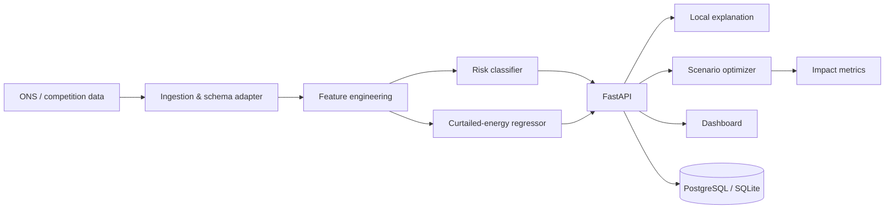

# Architecture

## Separation of concerns

- **Prediction** answers: how likely is a curtailment event under currently available information?
- **Magnitude** answers: if the event occurs, what magnitude is plausible?
- **Optimization** answers: under explicitly declared hypothetical assets/constraints, how much energy can be absorbed?
- **Impact** translates recovered energy into scenario KPIs.

The separation is intentional. It prevents the UI from calling every downstream calculation “AI” and makes the pitch technically defensible.
